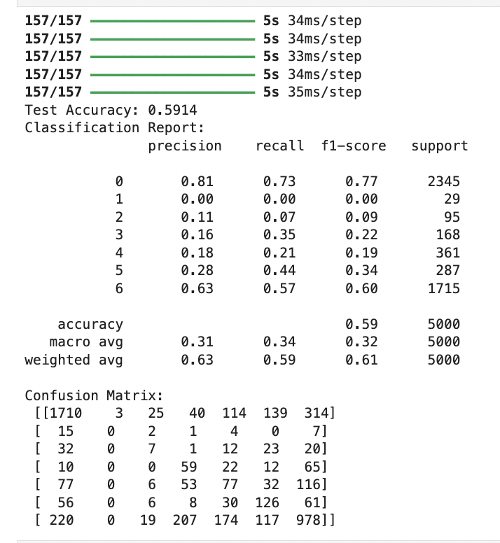

# Emotion_Aware_Multimodal_Chatbot_Project_Text_Image_and_Response_Generation

## 1. Project Overview

This project aims to build an empathetic chatbot that detects human emotions via either textual input or facial image and provides appropriate, context-sensitive responses.  
The chatbot is structured into three core components:

- A **Text-based Emotion Classification** model using Korean sentence data.
- An **Image-based Emotion Classification** model using facial expressions.
- A **Dynamic Response Generator** powered by KoGPT2.

Each model is independently trained and later integrated into a multimodal inference pipeline.

---

## 2. Project Structure

```
Emotion_Chatbot_Project/
│
├── KOTE/                             # Korean Online Text Emotion dataset
├── fer2013_data/                     # FER2013 facial expression images
├── empathic_data/                    # Response generation emotion-labeled dialogue
│
├── Emotional_Model(Text, LSTM).ipynb           # Text model training
├── Emotional_Model(Text, LSTM)-CoreML.ipynb    # CoreML-compatible text model
├── Emotional_Model(Image).ipynb                # Image model training
├── kogpt2_Double_pinetunning_keras.ipynb       # Response generation fine-tuning
│
├── emotion_text_model.h5                       # Final text model (.h5)
├── emotion_image_model.h5                      # Final image model (.h5)
├── kogpt2-finetuned-final/                     # Final KoGPT2 weights
```

---

## 3. Dataset

### Text:
- **KOTE Dataset** (44 emotion classes → mapped to 7 FER2013-style labels)
- Multi-label samples reduced to single-label using majority voting.
- Final emotion classes: Angry, Disgust, Fear, Happy, Sad, Surprise, Neutral

### Image:
- **FER2013** dataset (grayscale facial images, resized to RGB 224x224)
- Emotion labels: same 7 classes as text model

### Response:
- Empathy-based Korean dialogue pairs, each annotated with emotion label
- Used to conditionally train response generation using KoGPT2

---

## 4. Model Architecture

### Text Model:
- Mecab tokenization + stopword filtering
- Keras Tokenizer with `oov_token` and custom token extension
- Model: CNN + Bi-LSTM + GlobalAveragePooling1D (CoreML-compatible)
- Final architecture:
  - Embedding (mask_zero=True)
  - Conv1D → BatchNorm
  - BiLSTM (return_sequences=True)
  - GlobalAveragePooling1D
  - Dense(64) → Dropout → Dense(7, softmax)

### Image Model:
- CNN with 3 Conv2D + MaxPooling2D blocks
- Flatten → Dense → Dropout → Dense(7)

### Response Generator:
- KoGPT2 (`skt/kogpt2-base-v2`)
- Conditional fine-tuning using emotion → utterance mapping
- Training: input_ids, attention_mask, labels

---

## 5. Data Preprocessing

### Text:
- Mecab tokenizer + custom stopword removal
- Cleaned via regex (Korean + digits only)
- Early OOV issue resolved:
  - Increased `MAX_VOCAB_SIZE` and `EMBEDDING_DIM`
  - Reduced OOV rate to **0%**

### Image:
- FER2013 images resized to 224x224 RGB
- Augmented using ImageDataGenerator
- Normalized and batch-fed

### Response:
- Filtered for valid utterances
- Applied KoGPT2 tokenizer
- Truncated long samples, cleaned special tokens

---

## 6. Hyperparameter Tuning

Text model hyperparameters:
- dropout_rate = 0.3  
- learning_rate = 0.0003  
- batch_size = 64  
- lstm_units = 128  
- kernel_size = 3

Although the final training script used fixed values, **Grid Search** was attempted across the above parameters to find optimal settings.

Despite tuning, model performance was limited due to label imbalance and preprocessing.  
This led to investigation into vocabulary coverage → vocabulary and embedding dimensions were increased → successfully reduced OOV ratio to 0%.

---

## 7. Model Evaluation

### Text Model:
- Train accuracy: **95.72%**
- Test accuracy: **59.14%**
- Class weights were crucial: initially, F1-scores for class 1 (Disgust) and 2 (Fear) were 0.0
- After applying class weights: model successfully classified these minority classes with non-zero F1

### Image Model:
- Test accuracy: ~42%
- Trained on 7-way softmax using FER2013 faces

---

## 8. Confusion Matrix (Soft Voting)

- Final text model is an ensemble of 7 independently trained models
- Softmax outputs averaged using `keras.layers.Average()`
- Ensemble exported to `text_ensemble_model.h5` for CoreML conversion

---

## 9. Error Analysis

### Label Imbalance:
- Label 1 (Disgust) and 2 (Fear) were underrepresented
- Class weights successfully improved recall

### Multi-label Simplification:
- KOTE dataset contains overlapping emotions
- Simplified to one label per sample → may reduce nuance

### Vocabulary Handling:
- High OOV rate initially degraded model input quality
- Vocabulary/embedding size was expanded → OOV rate = **0%**

---

## 10. Performance Visualization

**Ensemble Model Confusion Matrix (7 Models):**



> Includes per-class performance:  
> - Labels 1 (Disgust) and 2 (Fear) showed major improvement after class weight adjustment  
> - Ensemble voting helped stabilize predictions across underrepresented classes

---

## 11. Comparison Summary

| Model        | Train Accuracy | Test Accuracy | Notes                         |
|--------------|----------------|----------------|-------------------------------|
| Text Model   | 95.72%         | 54.82%         | Ensemble (7 models)           |
| Image Model  | ~85%           | ~42%           | Basic CNN                     |
| Response Gen | N/A            | N/A            | GPT2-based text generation    |

---

## 12. Future Improvements

- Use multi-label classification for ambiguous emotion cases  
- Augment underrepresented classes (e.g., Disgust, Fear)  
- Merge image and text models into full multimodal fusion  
- Deploy to CoreML-compatible app for real-time usage  

---

## 13. References

- [KOTE Dataset](https://github.com/searle-j/KOTE)  
- [FER2013 Facial Dataset](https://www.kaggle.com/datasets/msambare/fer2013)  
- [KoGPT2 by SKT-AI](https://github.com/SKT-AI/KoGPT2)  
- [Apple CoreML Tools](https://github.com/apple/coremltools)  
- [AIHub 감성 기반 대화 말뭉치](https://aihub.or.kr/aihubdata/data/view.do?currMenu=115&topMenu=100&aihubDataSe=data&dataSetSn=71305)  
